# Architecture: Wallet & Bet Settlement Service

| | |
|---|---|
| **Status** | Proposed |
| **Stack** | C# / .NET (LTS), ASP.NET Core, EF Core + Npgsql, PostgreSQL 17, Docker |
| **Scope** | Play-money (ETB) wallet, fixed-odds betting, settlement, simulated payment webhook |
| **Primary goal** | Money-handling correctness under retries, failures and concurrency |

---

## 1. Purpose and Design Principles

The service lets users hold an ETB wallet, place bets on events with fixed odds, and receive payouts when events are settled or voided. No real money or payment provider is involved. The architecture optimises for **correctness over features**.

| # | Principle | Consequence |
|---|---|---|
| P1 | **The ledger is the source of truth** | Balances are derivable from `ledger_entries`; cached balances are an optimisation and are verifiable. |
| P2 | **One transaction per business operation** | A bet, its ledger entries, history rows, audit row and idempotency record commit or roll back together. |
| P3 | **The database enforces invariants** | Constraints and triggers back up application logic (non-negative wallets, balanced postings, append-only tables). |
| P4 | **Idempotency is transactional** | The idempotency record lives in the same transaction as the effect, so "recorded but not applied" is impossible. |
| P5 | **Integer money only** | `bigint` minor units (1 ETB = 100 santim). Odds are integer basis points. No floats or decimals in money paths. |
| P6 | **Never mutate history** | Corrections are compensating ledger entries, never updates or deletes. |
| P7 | **Keep it simple until it hurts** | Modular monolith, single database, row-level locks. Scaling paths are documented, not prematurely built. |

---

## 2. System Context

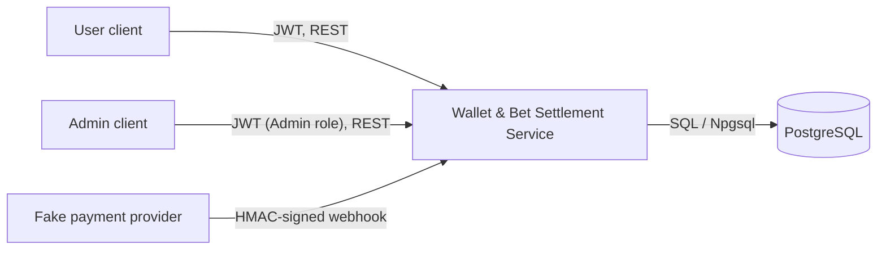

| Actor | Interaction |
|---|---|
| **User** | Registers, logs in, deposits, withdraws, places bets, views history. |
| **Admin** | Creates, closes, settles and voids events. |
| **Payment provider (simulated)** | Calls `POST /webhooks/deposit` to confirm deposits. Authenticated by HMAC, not JWT. |

---

## 3. Container and Component View

The system is a **modular monolith**: one deployable API, one PostgreSQL database, with clear internal module boundaries.

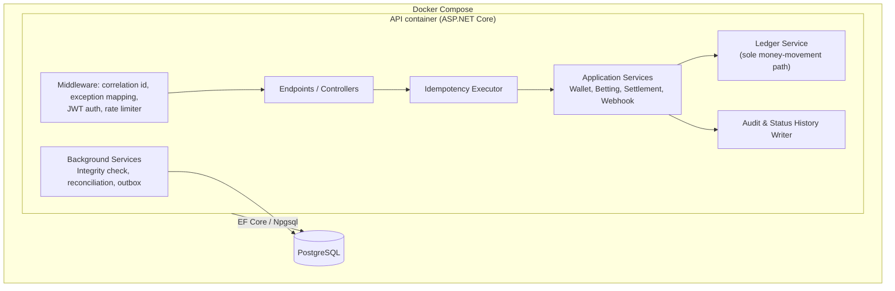

### Module responsibilities

| Module | Responsibility | Key rule |
|---|---|---|
| **Identity** | Registration, login, JWT issuing, role claims | User id is always taken from the token, never from a request body. |
| **Wallet** | Deposit, withdraw, balance, transaction history | Withdrawals check balance under a row lock. |
| **Betting** | Event creation/close, bet placement | Odds are snapshotted on the bet at placement. |
| **Settlement** | Settle and void events | Event row lock plus a status guard makes double settlement impossible. |
| **Webhook** | HMAC verification, dedupe, out-of-order handling | Verifies the raw body before parsing. |
| **Ledger** | Posts balanced transactions and updates cached balances | The only code allowed to write ledger tables. |
| **Idempotency** | Wraps state-changing operations | Insert-or-fetch inside the business transaction. |
| **Audit** | `audit_log` and status history rows | Written in the same transaction as the change. |

---

## 4. Repository Layout

```text
/
├── src/
│   ├── Wallet.Api/              # Program.cs, endpoints, middleware, auth, rate limiting, Swagger
│   ├── Wallet.Application/      # Use cases: Deposit, PlaceBet, SettleEvent, ProcessWebhook ...
│   ├── Wallet.Domain/           # Entities, value objects (Money, Odds), state machines, errors
│   └── Wallet.Infrastructure/   # EF Core DbContext, migrations, ledger, idempotency, background jobs
├── tests/
│   ├── Wallet.UnitTests/        # Money/odds math, state machines, HMAC verification
│   └── Wallet.IntegrationTests/ # Testcontainers Postgres + WebApplicationFactory
├── docs/
│   ├── ARCHITECTURE.md
│   └── DESIGN.md
├── Dockerfile
├── docker-compose.yml
└── README.md
```

Dependencies point inward: `Api → Application → Domain`, and `Infrastructure` implements interfaces defined in `Application`.

---

## 5. Data Architecture

### 5.1 Entity-relationship model

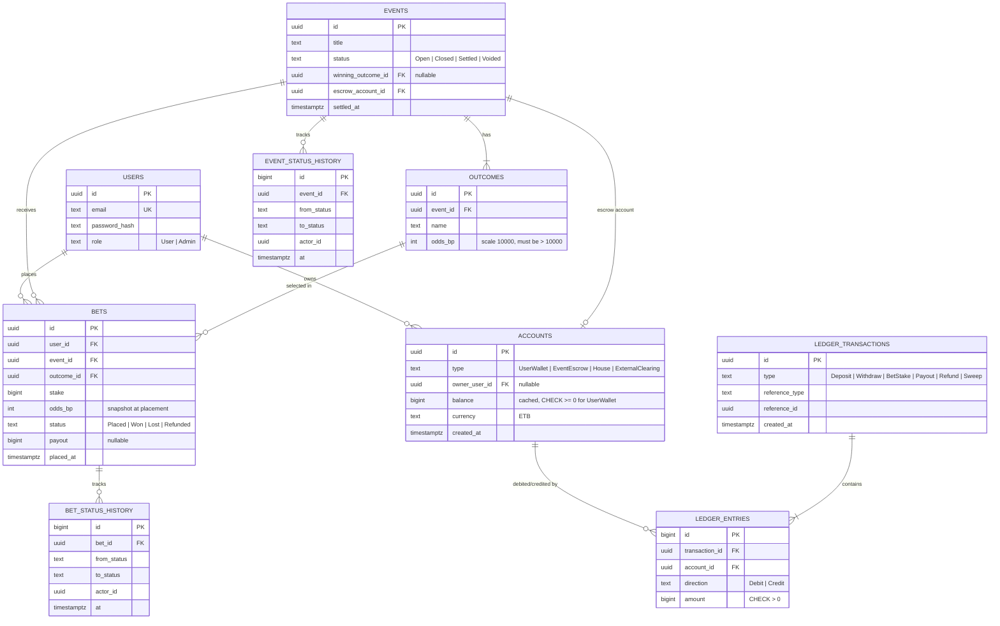

Supporting tables (not drawn above for readability):

| Table | Purpose | Key constraint |
|---|---|---|
| `idempotency_keys` | Request dedupe and response replay | `UNIQUE (scope, endpoint, key)`; stores `request_hash`, `response_code`, `response_body` |
| `webhook_deliveries` | Raw inbound webhooks and processing result | `UNIQUE (provider_event_id)` |
| `provider_deposits` | Deposit state keyed by provider reference | `UNIQUE (provider_reference)`; status `Pending → Confirmed / Failed` |
| `audit_log` | Who did what, when | Append-only; `actor_id, action, entity_type, entity_id, data jsonb, correlation_id, at` |
| `outbox_messages` *(bonus)* | Reliable event publishing | Written in the business transaction |

### 5.2 Database-enforced invariants

| Invariant | Mechanism |
|---|---|
| User wallets never go negative | `CHECK (balance >= 0)` on `UserWallet` accounts |
| Ledger amounts are positive | `CHECK (amount > 0)` on `ledger_entries` |
| Every ledger transaction balances | `DEFERRABLE INITIALLY DEFERRED` constraint trigger asserting `SUM(debit) = SUM(credit)` per transaction at commit |
| Ledger is append-only | `BEFORE UPDATE OR DELETE` triggers raise an exception on ledger, history and audit tables |
| One idempotency record per key | Unique index on `(scope, endpoint, key)` |
| One credit per provider deposit | Unique index on `provider_reference` |
| Event settles once | Status guard under `FOR UPDATE` lock, plus unique `event_id` on settlement records |

---

## 6. Ledger Design

### 6.1 Account types

| Account | Normal role | Allowed negative? |
|---|---|---|
| `UserWallet` | Liability to the user | No (enforced by `CHECK`) |
| `EventEscrow` | Holds stakes for one event | Only transiently inside a settlement transaction |
| `House` | Bookmaker capital and margin | Yes (a house loss is a negative balance) |
| `ExternalClearing` | Counterparty for simulated deposits/withdrawals | Yes (mirrors money "outside" the system) |

Using a **per-event escrow** makes each event self-contained: after settlement or void, its escrow must be exactly zero, which is an easy invariant to test and to audit. It also spreads write contention across events instead of one hot House row.

### 6.2 Posting rules

Debit/credit is expressed from the system's perspective; the sum of debits always equals the sum of credits.

| Operation | Debit | Credit |
|---|---|---|
| **Deposit** (API or webhook) | `ExternalClearing` | `UserWallet` |
| **Withdraw** | `UserWallet` | `ExternalClearing` |
| **Bet stake** | `UserWallet` | `EventEscrow` |
| **Payout** (winning bet) | `EventEscrow` | `UserWallet` |
| **Void refund** (per bet) | `EventEscrow` | `UserWallet` |
| **Settlement sweep** | `EventEscrow` → `House` if escrow > 0, or `House` → `EventEscrow` if escrow < 0 | Brings escrow to exactly 0 |

### 6.3 Calculations

```text
payout = floor(stake * odds_bp / 10000)      // integer math, rounds down in the house's favour
```

Use `Math.BigMul` or `checked` arithmetic to guard against overflow.

### 6.4 Balance model

- **Cached balance** on `accounts.balance` is updated in the same transaction as the entries, for O(1) reads and for the `CHECK` constraint.
- **Derived balance** is `SUM(credits) - SUM(debits)` for a wallet over `ledger_entries`.
- A **ledger integrity check** (Section 11) proves total debits = total credits and cached = derived for every account.

---

## 7. Cross-Cutting Concerns

### 7.1 Idempotency

Applies to: deposit, bet placement, settlement, void and the webhook (which uses the provider event id as its natural key).

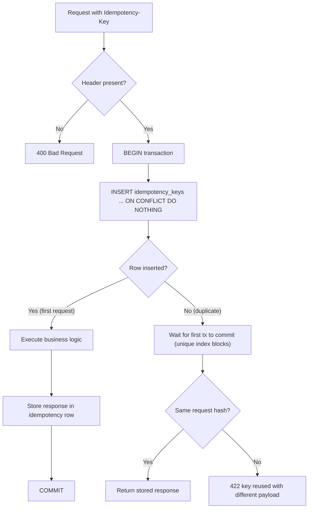

Why it is safe:
- Concurrent duplicates block on the unique index until the first transaction commits or rolls back.
- If the first request fails and rolls back, the key row vanishes with it, so a retry runs fresh.
- The scope is the authenticated principal, so one user's key cannot collide with another's.

### 7.2 Concurrency control

**Strategy: pessimistic row locks inside short transactions** (default isolation `READ COMMITTED`).

```sql
BEGIN;
SELECT balance FROM accounts WHERE id = @wallet FOR UPDATE;   -- serialises writers per wallet
-- verify balance >= stake, insert bet + ledger entries, update balance
COMMIT;
```

| Rule | Reason |
|---|---|
| Lock the wallet row before checking funds | Eliminates check-then-act races (double-spend) |
| Lock the event row `FOR SHARE` on bet placement; `FOR UPDATE` on close/settle/void | Bets cannot slip into an event that is being closed or settled |
| Acquire multiple locks in a **fixed order** (by id) | Prevents deadlocks |
| Keep transactions short; no external calls inside them | Limits lock hold time |
| `CHECK (balance >= 0)` as a backstop | Defence in depth if application logic regresses |

**Alternatives considered**

| Option | Verdict |
|---|---|
| Serializable isolation | Correct but needs retry loops and has higher abort rates on hot rows. |
| Optimistic concurrency (row version) | Retry storms when one user fires many bets quickly. |
| Atomic conditional update (`UPDATE ... WHERE balance >= @stake`) | Valid and fast; viable future optimisation, but row lock keeps the ledger posting logic simpler to reason about. |

### 7.3 Atomicity

Each use case runs inside a single database transaction:

| Use case | Contents of the transaction |
|---|---|
| Place bet | idempotency row, bet, ledger transaction + entries, balance update, bet history, audit |
| Settle event | idempotency row, event status change, every bet outcome, every payout posting, sweep, histories, audit |
| Void event | same shape as settle, with refunds |
| Webhook | delivery record, deposit state, ledger posting, audit |

An exception anywhere rolls back everything. Settlement processes all bets in one transaction for this scope; chunked settlement is described in the scaling section.

### 7.4 Security

| Concern | Approach |
|---|---|
| **Authentication** | JWT bearer tokens (short-lived), signed with a secret from environment configuration. |
| **Authorisation** | Role policies: `Admin` for `/admin/*`; `User` endpoints operate only on the token's subject. |
| **Webhook auth** | `HMAC-SHA256(secret, timestamp + "." + rawBody)` in a header; constant-time comparison (`CryptographicOperations.FixedTimeEquals`); reject timestamps older than ~5 minutes. |
| **Input validation** | Stake bounds, positive amounts, 2 to 3 outcomes, odds greater than 1.00, request size limits. |
| **Rate limiting** | ASP.NET Core `RateLimiter`, partitioned per user id on `POST /bets`. |
| **Passwords** | Salted hash (ASP.NET Core `PasswordHasher` or Argon2/BCrypt). |
| **Secrets** | Environment variables; never committed. |
| **Error handling** | Problem Details (RFC 9457) responses; no stack traces or internals leaked. |

### 7.5 Auditability

- `audit_log` row for every state-changing call: actor, action, entity, payload, correlation id, timestamp.
- `event_status_history` and `bet_status_history` rows for every transition.
- All are append-only (trigger-enforced) and written inside the business transaction, so a history row exists if and only if the change committed.

---

## 8. Key Flows

### 8.1 Place a bet

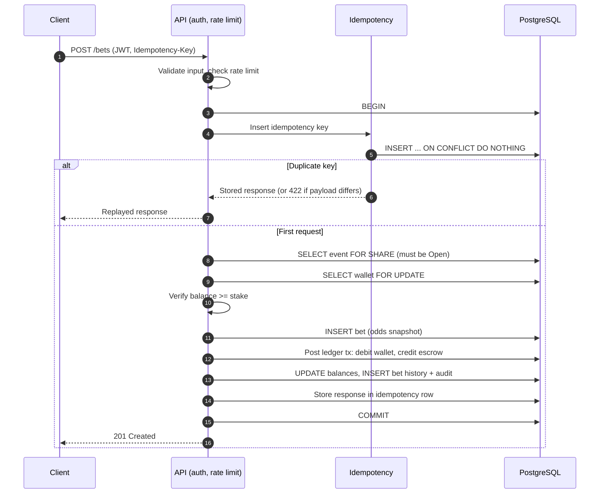

### 8.2 Settle an event

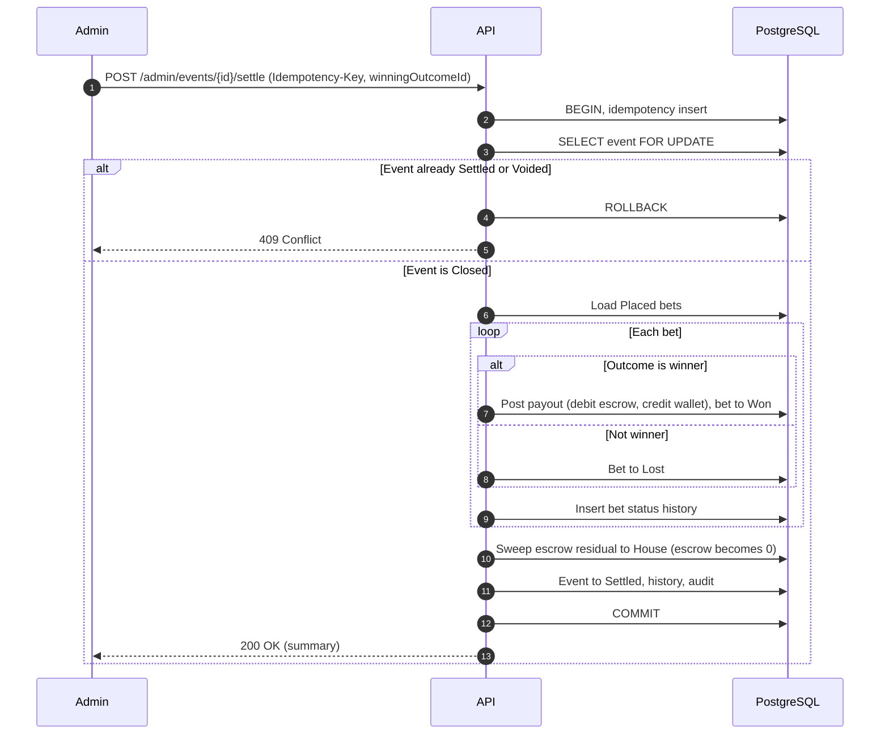

Any failure mid-loop rolls back the entire settlement. Void follows the same shape, refunding every stake and marking bets `Refunded`.

### 8.3 Inbound webhook

The JSON body contains `providerEventId`, `providerReference`, `userId`, `amount` (ETB minor
units), and `status` (`Pending`, `Confirmed`, or `Failed`). The provider sends `Idempotency-Key`,
`X-Timestamp` (Unix seconds), and `X-Signature` (hex HMAC-SHA256 of the UTF-8 bytes of
`timestamp + "." + rawBody`). The timestamp must be within five minutes of the server clock.
The idempotency key protects request retries; the unique provider event id independently protects
against duplicate deliveries sent with different keys.

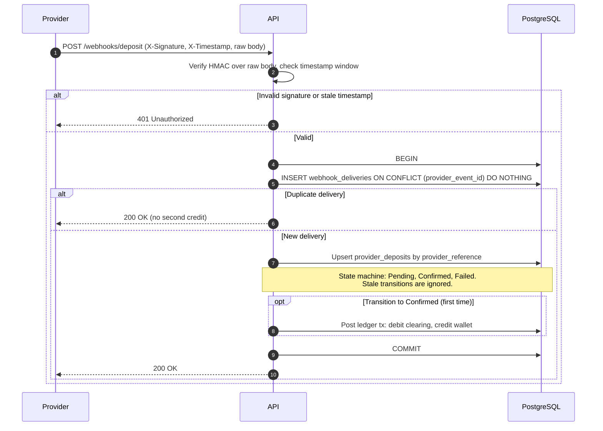

---

## 9. State Machines

### Event

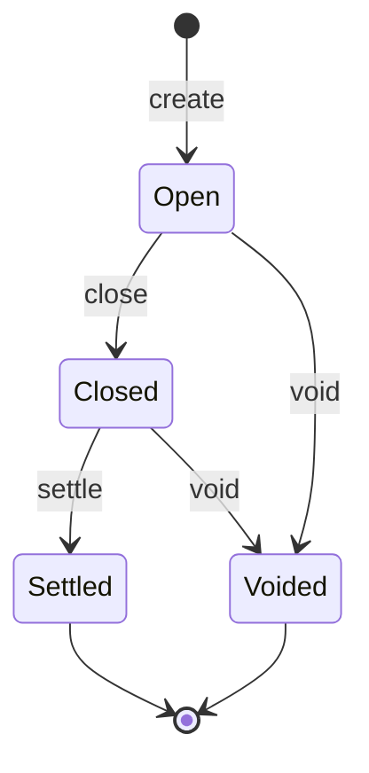

### Bet

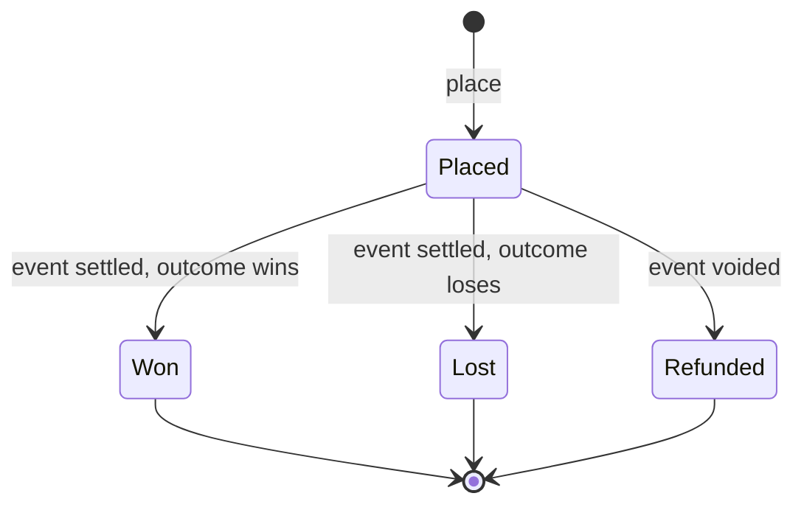

### Provider deposit (out-of-order tolerant)

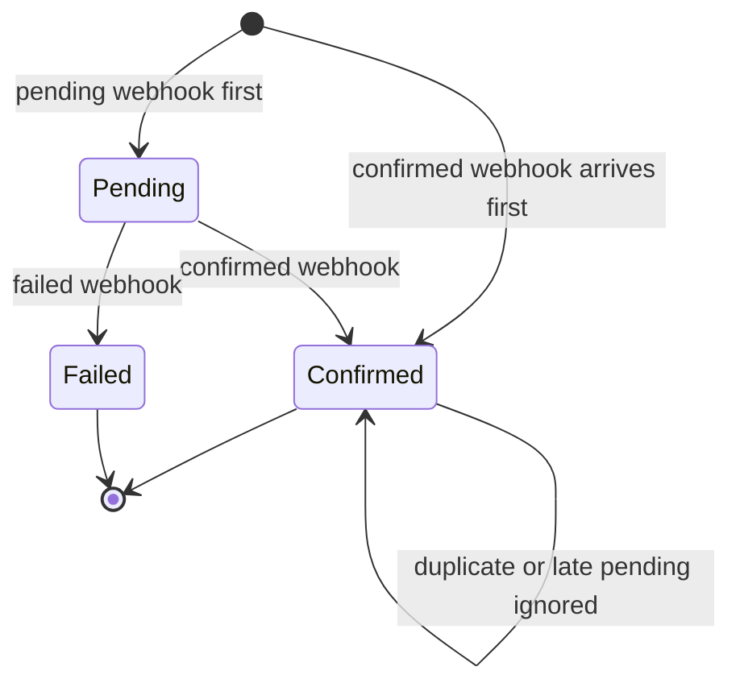

Terminal states are never left. A late or duplicate message that would move a deposit backwards is recorded and ignored.

---

## 10. API Surface

| Method & path | Auth | Idempotent | Purpose |
|---|---|---|---|
| `POST /auth/register` | None | No | Create user, wallet |
| `POST /auth/login` | None | No | Obtain JWT |
| `GET /wallet` | User | n/a | Current balance |
| `POST /wallet/deposit` | User | **Yes** | Simulated deposit |
| `POST /wallet/withdraw` | User | **Yes** | Simulated withdrawal with balance check |
| `GET /wallet/transactions` | User | n/a | Paginated history |
| `POST /bets` | User (rate limited) | **Yes** | Place bet |
| `GET /bets` | User | n/a | List own bets |
| `POST /admin/events` | Admin | No | Create event with 2 to 3 outcomes |
| `POST /admin/events/{id}/close` | Admin | Safe to repeat | Close for betting |
| `POST /admin/events/{id}/settle` | Admin | **Yes** | Declare winning outcome |
| `POST /admin/events/{id}/void` | Admin | **Yes** | Refund all stakes |
| `POST /webhooks/deposit` | HMAC | **Yes** (`Idempotency-Key` and provider event id) | Deposit confirmation |

Conventions:
- Errors use Problem Details. Common codes: `400` validation / missing key, `401` bad auth or signature, `402`-style insufficient funds mapped to `409` or `422` (choose one and document it), `403` wrong role, `404`, `409` state conflict, `422` idempotency payload mismatch, `429` rate limited.
- OpenAPI/Swagger documents the JWT scheme and the `Idempotency-Key` header.

---

## 11. Background Processing and Observability

| Component | Description | Priority |
|---|---|---|
| **Ledger integrity check** | Hosted service, daily: asserts `SUM(debits) = SUM(credits)` globally, cached balance = ledger-derived balance per account, every `EventEscrow` of a settled/voided event is 0. Emits a metric and an error log on failure. | High (bonus) |
| **Reconciliation job** | Compares `provider_deposits` / webhook deliveries against the simulated provider's report; writes discrepancies to an exceptions table. | Medium (bonus) |
| **Outbox publisher** | Reads `outbox_messages` written in business transactions and publishes events (logged in this scope). | Medium (bonus) |
| **Structured logging** | Serilog JSON logs with correlation id, user id and entity ids; money amounts logged, secrets never. | High |
| **Metrics** | Request latency, bet success/failure counts, idempotent replays, webhook signature failures, lock wait times, integrity-check result. | Medium |
| **Health checks** | `/health/live` and `/health/ready` (database connectivity). | High |

---

## 12. Deployment View

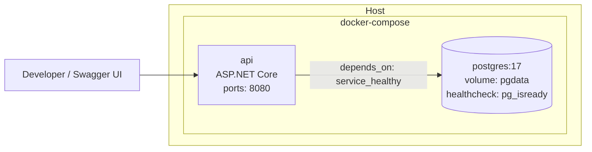

| Concern | Decision |
|---|---|
| **Startup** | `docker compose up --build` builds the API image (multi-stage) and starts Postgres, then the API after its health check succeeds. |
| **Migrations** | Applied automatically by the API at startup. |
| **Seeding** | System accounts (`House`, `ExternalClearing`) and an admin user (credentials from environment variables). |
| **Configuration** | Environment variables: connection string, JWT key and issuer, webhook secret, rate-limit settings. Compose includes local-only demo defaults; override them before use outside a local development machine. |
| **CI (bonus)** | GitHub Actions: restore, build, test (Testcontainers), build Docker image. |

Run the local stack from the repository root with `docker compose up --build`. The API is available
at `http://localhost:8080` and Swagger at `/swagger`; PostgreSQL is exposed only on localhost at
port 5432 and its data persists in the `pgdata` volume. Set `POSTGRES_PASSWORD`, `JWT_KEY`,
`WEBHOOK_SECRET`, and optionally `ADMIN_EMAIL` / `ADMIN_PASSWORD` in the environment to override
the compose defaults. The defaults are for local development only and must not be used in production.
Use `docker compose down` to stop the services; `docker compose down -v` also removes the local
database volume and all data stored in it.

---

## 13. Testing Strategy

Integration tests run against a **real PostgreSQL** (Testcontainers) through `WebApplicationFactory`, because locking and constraint behaviour cannot be faked.

| Required test | Scenario | Assertions |
|---|---|---|
| **Concurrent double-spend** | Wallet holds 100; 20 parallel bets of 60 with distinct keys | Exactly 1 succeeds; wallet = 40; ledger-derived balance = 40; no negative balance |
| **Idempotency** | Same key sequentially and 10x in parallel; same key with different body | One effect; identical replayed responses; `422` for payload mismatch |
| **Double settlement** | Settle twice (same key, different keys, in parallel) | Payouts applied once; second call `409`/replay; escrow = 0 |
| **Webhook replay** | Same signed payload 5x; bad signature; stale timestamp; confirmed-before-pending | One credit; `401` for bad signature/timestamp; late pending ignored |

Additional high-value tests:
- Ledger invariant (`SUM(debit) = SUM(credit)`) checked after every scenario.
- Settlement failure injected mid-loop leaves no partial payouts.
- Authorisation matrix (user vs admin, cross-user access).
- Unit tests for payout math (rounding, overflow) and state-machine transitions.

---

## 14. Key Decisions and Trade-offs

| # | Decision | Alternatives | Trade-off accepted |
|---|---|---|---|
| ADR-1 | Modular monolith | Microservices | Simpler to run and reason about; less independent scaling. |
| ADR-2 | Pessimistic row locks | Serializable, optimistic | Predictable and simple; hot wallets serialise (acceptable, one user's bets rarely need parallelism). |
| ADR-3 | Idempotency inside the business transaction | Separate store/Redis | Strongest correctness guarantee; idempotency table sits on the primary DB. |
| ADR-4 | Cached balance plus ledger | Pure ledger sums | Fast reads and `CHECK` enforcement; requires integrity checks to guard drift. |
| ADR-5 | Per-event escrow account | Single House pool | Easier audit and less contention; more accounts to manage. |
| ADR-6 | Single-transaction settlement | Chunked/async settlement | Atomic and simple; long transaction for very large events. |
| ADR-7 | Odds in basis points, floor rounding | `decimal` | Exact integer arithmetic; documented rounding favours the house. |
| ADR-8 | DB triggers for append-only and balance | App-level checks only | Invariants hold even against buggy code; slightly more migration complexity. |

---

## 15. Scaling and Production Path

**At roughly 1,000 bets per second**

| Bottleneck | Mitigation |
|---|---|
| Hot event / escrow rows | Shard escrow into N sub-accounts per event; aggregate at settlement. |
| Wallet lock contention | Atomic conditional `UPDATE ... WHERE balance >= @stake`; keep transactions minimal. |
| Ledger table growth | Time-partition `ledger_entries`; archive old partitions. |
| Read load | Read replicas for history and balance reads. |
| Large settlements | Chunk bets into batches processed by a worker via queue/outbox, with a per-event settlement state machine and resume-on-failure. |
| Connection pressure | PgBouncer in transaction mode; tune pool sizes. |
| Idempotency table growth | TTL-based cleanup of old keys. |

**External provider reconciliation**
Periodically pull the provider's settlement report and match it against `provider_deposits` and `ExternalClearing` postings by provider reference. Classify results (matched, missing locally, missing at provider, amount mismatch), write them to an exceptions table for review, and correct only through compensating ledger entries.

**Before going live**
- Monitoring and alerting: ledger imbalance, failed settlements, webhook signature failures, latency SLOs, lock wait and deadlock rates.
- Fraud and risk: velocity limits, maximum stake and per-event exposure, anomaly detection, withdrawal review rules.
- Compliance: KYC/AML, licensing, responsible-gambling controls, audit-log retention and tamper-evidence.
- Operations: backups with point-in-time recovery, secrets management and key rotation, security testing, load testing, runbooks.

---

## 16. Suggested Build Order

1. Solution skeleton, schema and migrations (including triggers and constraints)
2. Ledger service and money/odds value objects
3. Idempotency executor
4. Auth, roles, validation, rate limiting
5. Wallet endpoints (deposit, withdraw, history)
6. Events and bet placement
7. Settlement and void
8. Signed webhook with dedupe and out-of-order handling
9. Docker, compose and auto-migration
10. Required integration tests
11. README, DESIGN.md, Swagger polish
12. Bonus: integrity check, structured logging, CI, outbox
